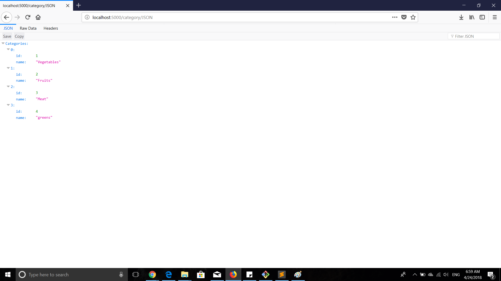
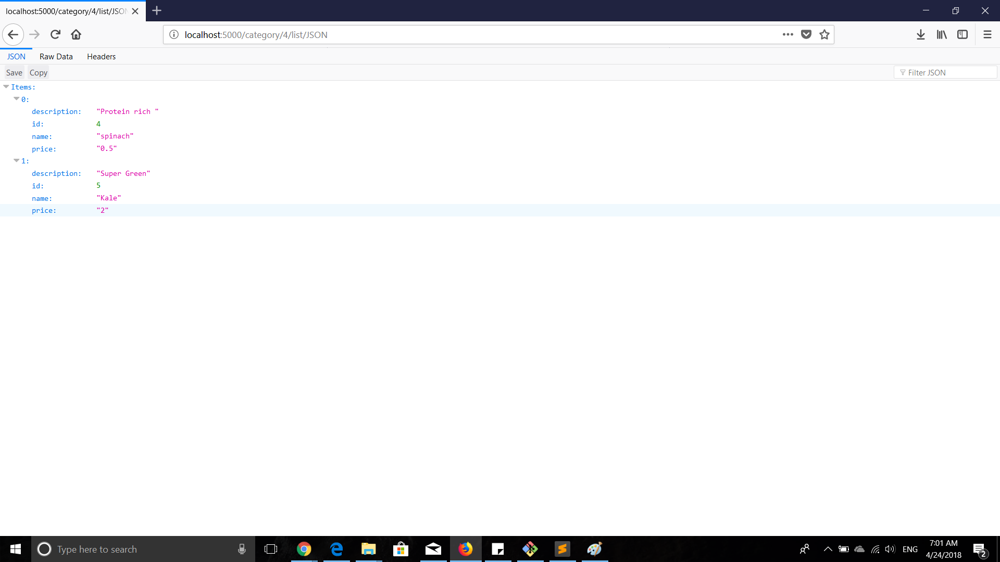
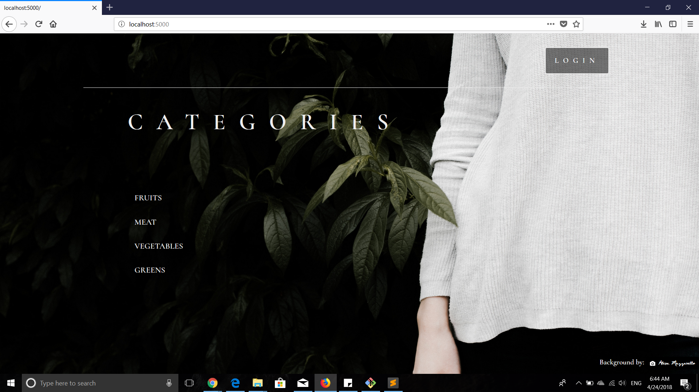
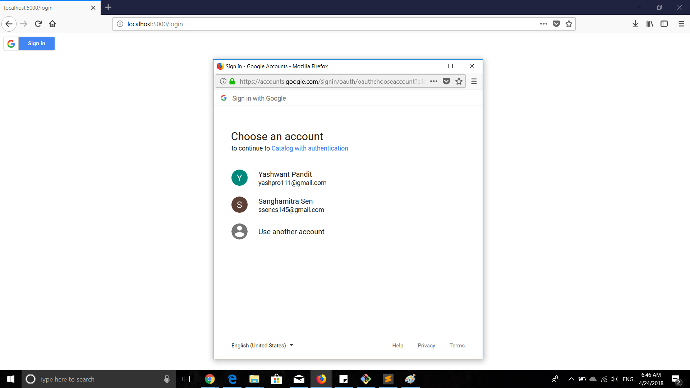
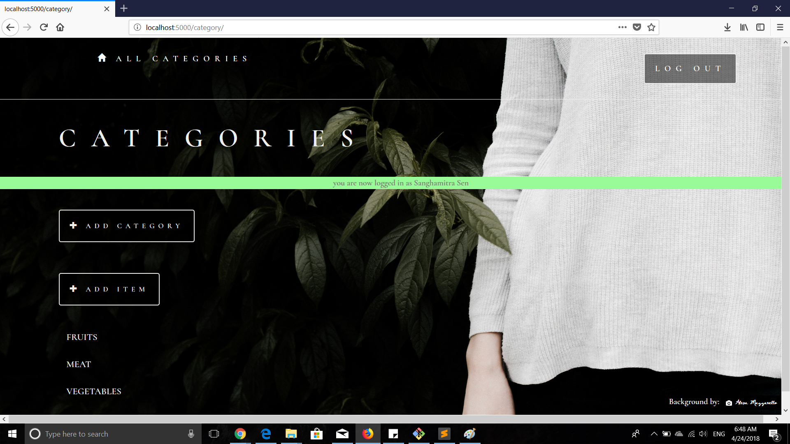
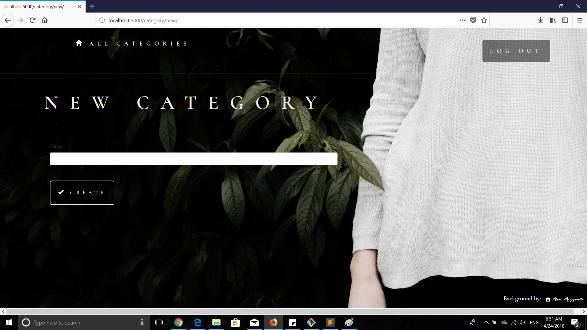
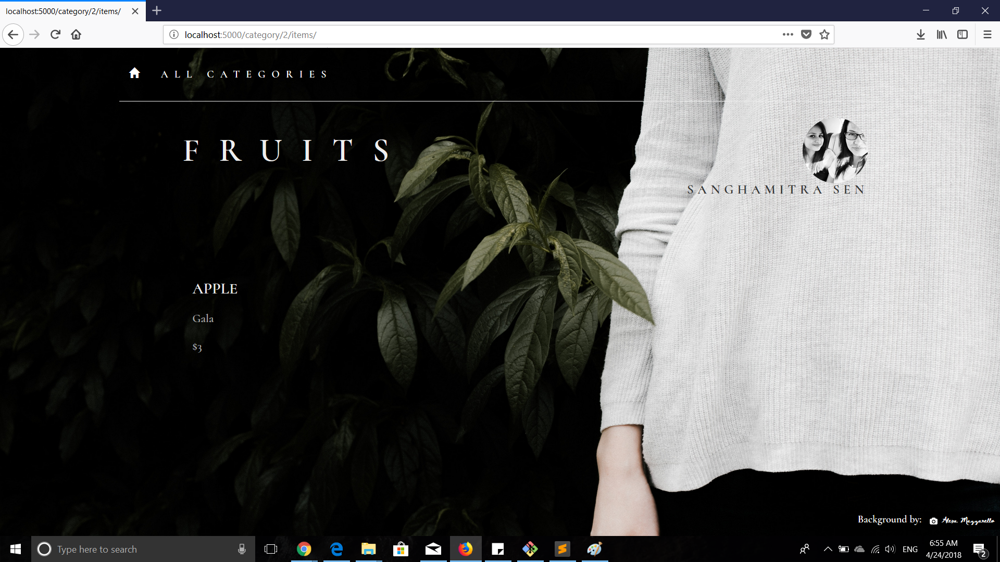
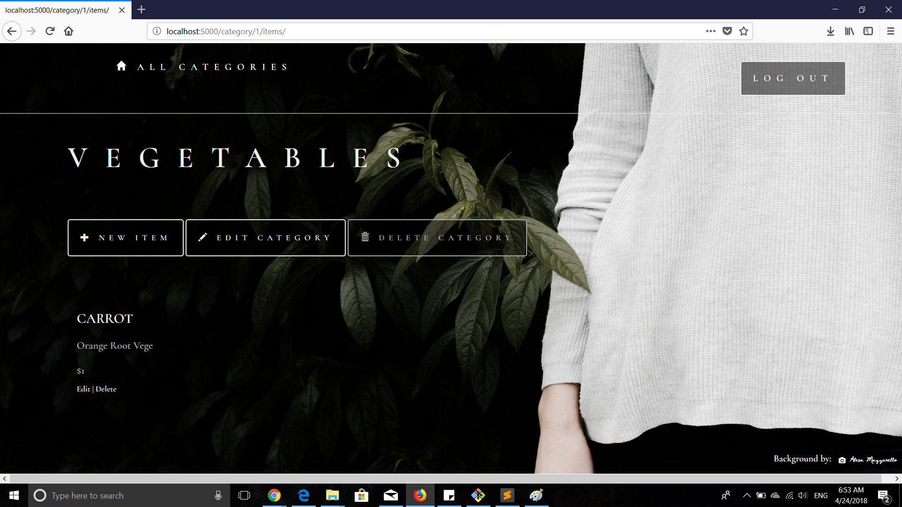

# itemCatalog
FSWD project

## JSON Endpoints

`/category/JSON` - Returns JSON of all categories in catalog

`/category/<int:cid>/list/<int:mid>/JSON` - Returns JSON of selected item in category

`/category/<int:cid>/list/JSON` - Returns JSON of all items in particular category in catalog

## Landing Page(not yet logged in)
`/category`

## Authentication(Logging in)

`/login` 

## Landing Page(Logged in)

`/login` 

## Adding New Category
`/category/new` 

## Adding New Item
While adding info about item, in category list only those categories appear which that user has created
`'/category/item/new/`

## Item List(not authorised)
Example of logged in but not authorised

## Item List(authorised)
Example of logged in & authorised

