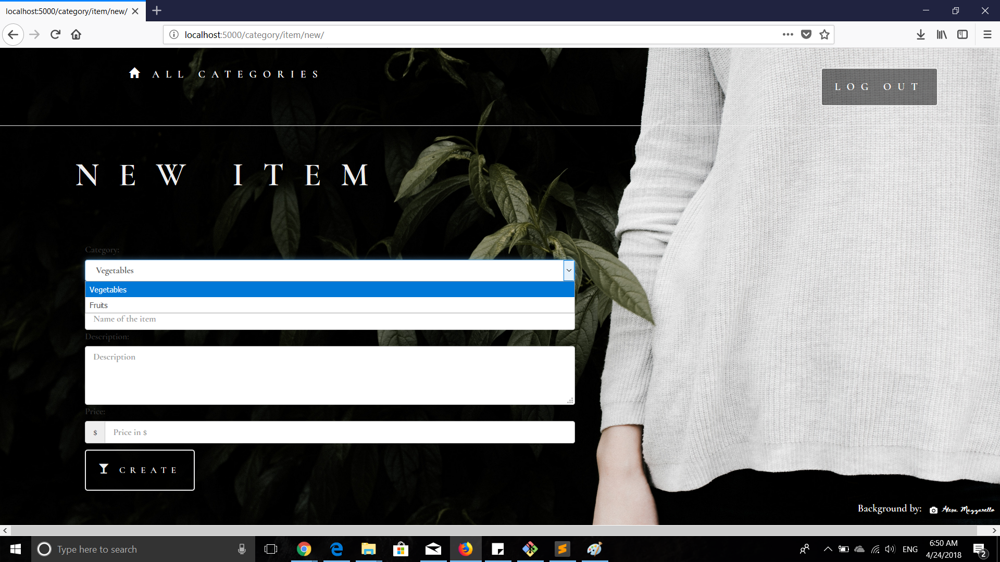

# itemCatalog
FSWD project(Backend)
## Project Description
The database contains newspaper articles, as well as the web server log for a site. The log has a database row for each time a reader loaded a web page. Using that information, the code will answer the following questions about the site's user activity:
 * What are the most popular three articles of all time?
 * Who are the most popular article authors of all time?
 * On which days did more than 1% of requests lead to errors?
## Pre-Requisites
  * **Python** should be installed. 
    You can get it from:https://www.python.org/downloads/
  * **A terminal like Git Bash.**
    If you don't already have Git installed, download Git from git-scm.com.
  * **VirtualBox.**
    You can download it from https://www.virtualbox.org/wiki/Download_Old_Builds_5_1. Make sure to choose October 2017 version       so         that it is compatible with vagrant.
  * **Vagrant.**
    You can download it from https://www.vagrantup.com/downloads.html
  * **Google account** is required.Create one here:https://accounts.google.com/signup/v2/webcreateaccount?hl=en&flowName=GlifWebSignIn&flowEntry=SignUp
## Steps to execute the project
  * Clone vagrant repo from udacity-->https://github.com/udacity/fullstack-nanodegree-vm/tree/master/vagrant.
  * Clone this repo and place it inside vagrant folder of above and cd into vagrant folder.
  * Start the virtual machine using command:**vagrant up**
  * Once done,login using **vagrant ssh** and then type **cd /vagrant**
  * To execute the queries run this command: **python project.py**
  * Visit **localhost:5000** and login inorder to add category or item.
  
## JSON Endpoints

`/category/JSON` - Returns JSON of all categories in catalog

`/category/<int:cid>/list/<int:mid>/JSON` - Returns JSON of selected item in category

`/category/<int:cid>/list/JSON` - Returns JSON of all items in particular category in catalog

## Landing Page(not yet logged in)
`/category`

## Authentication(Logging in)

`/login` 

## Landing Page(Logged in)

`/login` 

## Adding New Category
`/category/new` 

## Adding New Item
While adding info about item, in category list only those categories appear which that user has created
`'/category/item/new/`

## Item List(not authorised)
Example of logged in but not authorised

## Item List(authorised)
Example of logged in & authorised

